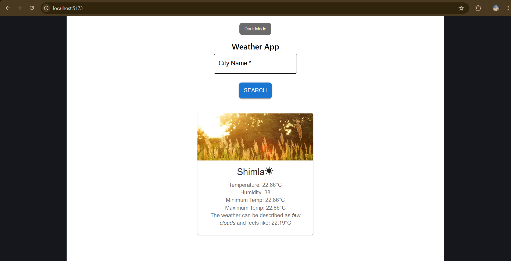
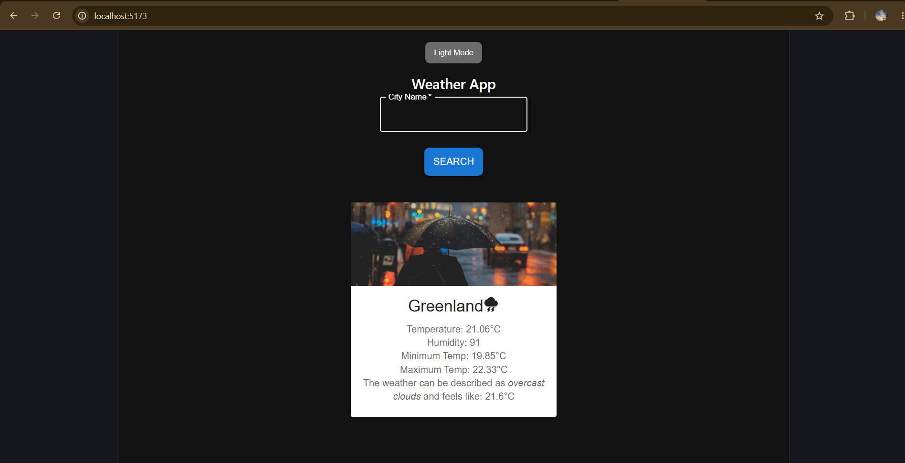

# 🌦️ Weather App

A modern weather application built with **React**, **Vite**, and **Material UI** that provides real-time weather information using the OpenWeather API.


---

## 📸 Application Preview

### 🌞 Light Mode



### 🌙 Dark Mode



---

## 🚀 Features

* Real-time weather data retrieval
* Search weather by city name
* Temperature, humidity, and weather condition display
* Weather icons for better visualization
* Dark / Light theme toggle
* Error handling for invalid city names
* Responsive and clean user interface

---

## 🛠️ Tech Stack

* React.js
* Vite
* Material UI (MUI)
* JavaScript
* CSS
* OpenWeather API

---

## 📂 Project Structure

```text
src/
├── SearchBox.jsx
├── InfoBox.jsx
├── WeatherApp.jsx
├── SearchBox.css
├── InfoBox.css
├── WeatherApp.css
└── assets/
```

## ⚙️ Installation

### Clone the Repository

```bash
git clone https://github.com/aashirajpoot/Weather-App.git
```

### Navigate to Project Folder

```bash
cd Weather-App
```

### Install Dependencies

```bash
npm install
```

### Create Environment Variable

Create a `.env` file in the root directory:

```env
VITE_WEATHER_API_KEY=your_api_key_here
```

### Run the Application

```bash
npm run dev
```

---

## 🔄 Application Flow

```text
User
  ↓
Search City
  ↓
OpenWeather API
  ↓
Fetch Weather Data
  ↓
React Components
  ↓
Display Weather Information
```

---

## 🎯 Learning Outcomes

This project helped me gain practical experience in:

* API Integration
* React Hooks (useState)
* Component-Based Architecture
* Conditional Rendering
* Environment Variables
* Git & GitHub
* Material UI Components
* Responsive UI Design

---

## 🔮 Future Improvements

* 5-Day Weather Forecast
* Current Location Weather
* Search History
* Weather Charts
* Enhanced UI Animations
* Theme Persistence using Local Storage

---

## 👨‍💻 Author

Aashi Rajpoot